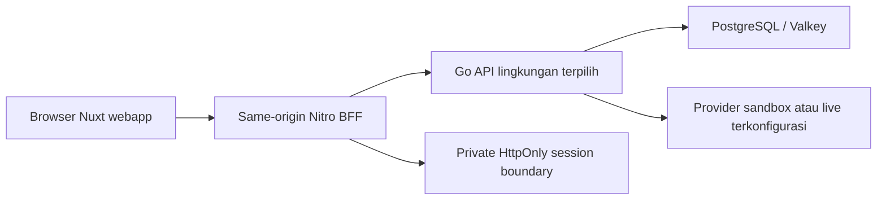

# Kontrak, baseline dan arsitektur integrasi

Tanggal: 3 Oktober 2026. Snapshot source dibaca selama perencanaan; backend aktif dikembangkan. Hash di bawah adalah evidence review, bukan generated registry yang perlu dipelihara pada setiap edit. Adapter task wajib memeriksa delta source dan route deploy sebelum wire.

## Otoritas dan status aktual

Source handler/domain/model dan schema menentukan implementasi; SRS/PRD/TECH menentukan target dan owner requirements. Proposal OpenAPI roadmap bukan jaminan endpoint aktif. Router sekarang mencakup OTP/session/guest bookings/artifacts/refund-status dan finance routes. Laporan gap lebih awal mendahului tambahan finance; jangan menjadikan ketidakhadiran route pada laporan lama sebagai blocker current source tanpa memeriksa ulang.

FE sekarang memakai createMockBookingClient, Money exponent2, static rooms/ratePlans dan module-scoped maps untuk demo status. Tidak ada BFF/server API baru atau guest/staff auth UI. Semua task paket ini mengganti boundary tersebut, bukan membuat demo lain yang diberi label live. Module singleton map tidak boleh menyimpan PII/session antar request SSR.

## Arsitektur target

`server/api/bff/...` merupakan endpoint FE yang direncanakan. Gunakan handler allowlist eksplisit; tidak membuat catch-all proxy yang meneruskan Authorization/X-User-Role/ID/Testing-Role dari browser. Go URL, session secret, provider allowlist dan environment mode adalah runtimeConfig private. Public config hanya UX mode/capabilities nonsecret. Credentials/provider keys tidak masuk Nuxt payload, bundle atau URL.

Sesi BFF menggunakan library/session primitive yang didukung runtime, bukan algoritma crypto buatan sendiri. Pilih encrypted/sealed cookie dengan secret environment dan batas payload, atau durable server-side session store dengan opaque cookie bila ukuran/revocation membutuhkan; keputusan BASE-03 dicatat sebelum implementasi. Jangan gunakan process Map untuk production sessions. Token guest upstream dan post-create booking token memiliki scope berbeda; jangan saling ditukar. TTL tidak melebihi upstream, HttpOnly/SameSite/Secure HTTPS, no-store pada private fetch. Mutasi cookie-based punya trusted origin/CSRF guard; deployment proxy forwarding hanya dari sumber tepercaya.

SSR/private state dibuat request-scoped. useFetch/useAsyncData untuk load halaman; $fetch untuk action. Browser menggunakan same-origin BFF; SSR meneruskan cookie ke BFF sendiri melalui Nuxt request context, bukan ke URL arbitrer. Tanpa kebutuhan autentikasi, public catalog/search tetap lewat BFF untuk kontrak/error/origin konsisten. Upstream timeouts bounded, GET retry terbatas, mutation tidak auto-retry.

## Boundary tipe dan migrasi model

| Model | Upstream aktual | Target FE / migration |
|---|---|---|
| Money | int64 IDR rupiah; exponent0 | Ubah Money/formatMoney menjadi exponent0 untuk API, fixtures migrasi explicit. Tolak integer di luar Number safe range; jangan menyimpan hasil floating point |
| Search | snake_case tanggal, total adults/children, rooms, child_ages | DateOnly YYYY-MM-DD, half-open stay, occupancies UI disimpan; agregasi v1 diuji dan validasi per room tidak diklaim backend jika belum ada |
| Room | canonical UUID, family_name/bed_type/room_size_sqm, photos | Mapper view model; jangan pakai ID fixture demo ke backend |
| Quote | quote_id, created_at/expires_at, satu room_type/rate, nightly_rates, pricing, cancellation | immutable selected quote + server policy; one variant/plan for quantity; semantic num_guests dan breakfast gate |
| Guest create | guest_name/email/phone, estimated_arrival_time, special_requests | Field mapping eksplisit, max request500 Unicode, phone/arrival validations selaras, terms/privacy terpisah |
| Create result | booking + guest_access_token + payment_url/reference + server_time/expires_at | BFF mengonsumsi token, menyimpan secure access; browser menerima sanitized DTO/allowed redirect; reference pembayaran tidak disamakan booking ID |
| Status | pending/confirmed/checked_in/checked_out/cancelled/expired/failed/no_show | Domain enum dipertahankan. processing/needs_assistance adalah UI network/payment knowledge state, bukan enum DB palsu |
| Guest list/detail | {data,total}; {booking,allowed_actions} | Private view; total = length current response; capability-aware actions, no invented cursor |
| Receipt | ReceiptDTO nested hotel/stay/guest/room/pricing/payment/policies | Printable server snapshot; ICS binary dari BE, bukan generate FE; server PDF berbeda dari print browser |
| Finance | has_refund/refunds; cases/total; summary fields | Guest refund read sekarang; staff execution gated auth/provider acceptance |
| Errors | ProblemDetails code/detail/status dan guest error/message | Normalized ApiError {code,message,status,fieldErrors?,retryable,requestId?}; unknown safe fallback |

Transport types direncanakan `shared/types/backend.ts`; mapper/services `app/services/*`; unit contract fixtures `tests/fixtures/backend/`. API availability/capability disimpan pada konfigurasi explicit dan diverifikasi BASE-04; jangan mencoba arbitrary fallback route saat 404. UI map field opsional hilang dengan fallback jujur; required-field/type mismatch menghasilkan controlled contract error.

## Retry, persistence dan time

Create memakai UUID acak sebagai Idempotency-Key ≤64 karakter, satu frozen payload serialization sepanjang retry. Jangan memakai email/key panjang atau mengubah whitespace/body urutan selama attempt yang sama. Jika input berubah, invalidate attempt setelah memastikan old outcome diketahui; jangan membuat key baru untuk ambiguous response. Backend atomicity tetap BE-R08; FE cannot supply exactly-once guarantee. Simpan access selepas create sebelum navigate; refresh/deep link mendapat private server read. Draft persistence yang diperlukan tidak menyimpan PII/token di localStorage; setelah completed/reset bersihkan guest/quote/consent/attempt, booking access tetap mengikuti sesi aman.

Server deadline mengendalikan quote/hold; keduanya berbeda. Clock anchor serverTime dari create, lalu monotonic elapsed/visibility resync; GET Booking belum memiliki server_time, sehingga BFF observedAt hanya estimasi receipt time, bukan absolute server precision. Expiry timer memicu re-fetch. Jangan local transition pending→expired/confirmed tanpa server. Polling dibatasi, pause hidden/terminal, re-fetch on focus, stop on unmount/logout.

## Task foundation

- [ ] **BASE-01:** catat source/deploy routes, DTO examples, migration/provider mode dan delta owner; tandai source-present vs reachable vs accepted.
- [ ] **BASE-02:** actual DTO fixtures, canonical IDs, Money/date/status/error mapper; guard unsupported mixed cart dan unsafe integers.
- [ ] **BASE-03:** BFF runtime config, endpoint allowlist, sanitized headers, secure session, CSRF/no-store, token/PII redaction dan SSR isolation.
- [ ] **BASE-04:** isolated backend smoke GET/readiness, route support dan explicit mock/api environment; credential failures fail-closed.

## Snapshot evidence

| Source yang diperiksa | SHA-256 saat paket direncanakan |
|---|---|
| [internal/api/router.go](/mnt/code/projects/jobs/pulang/current-booking/internal/api/router.go) | `26bdca6f490504594bc43f8761697820626310ce057f16e50c4be7683443d6d7` |
| [internal/api/guest_auth.go](/mnt/code/projects/jobs/pulang/current-booking/internal/api/guest_auth.go) | `01dbf662386c15f692dbef29f3141c1f43df1d14989faf2829f9b0a7a3bf1a4a` |
| [internal/api/finance_handler.go](/mnt/code/projects/jobs/pulang/current-booking/internal/api/finance_handler.go) | `e1cec10987e3c7b99d2b906b9c70f9d7fb35bd8ca394f7c12114c799783dff41` |
| [internal/api/middleware.go](/mnt/code/projects/jobs/pulang/current-booking/internal/api/middleware.go) | `6b45b7c0023d53ee9833612ab41b1d37c4c5bb0578d75d3200fb2cd87d430c27` |
| [internal/api/idempotency.go](/mnt/code/projects/jobs/pulang/current-booking/internal/api/idempotency.go) | `49eb84b347c3fd71c7a58c3b640ac311e7e354af9d7f8472aef0417ed0ea88c7` |
| [internal/booking/booking.go](/mnt/code/projects/jobs/pulang/current-booking/internal/booking/booking.go) | `6b5bbf7e06465b1a0c5323b4d9ffccd1f346d7ea9f951bbfa162b66ac6071805` |
| [internal/booking/service.go](/mnt/code/projects/jobs/pulang/current-booking/internal/booking/service.go) | `b681e2695471f3a4d4b4300cceb95e7303b21ef230391effb80efc327e4ba100` |
| [internal/guest/model.go](/mnt/code/projects/jobs/pulang/current-booking/internal/guest/model.go) | `c45ecab15a568546b7d3fafbce88c584bcc549d2a7f546ca718c44e924f46995` |
| [internal/guest/service.go](/mnt/code/projects/jobs/pulang/current-booking/internal/guest/service.go) | `cd96673b9d6997f2ce7603056d9101523fcddb7b4ecbd4b7cdc438c5444079ab` |
| [internal/rates/engine.go](/mnt/code/projects/jobs/pulang/current-booking/internal/rates/engine.go) | `cafe461466288e5eb05de7b63248f2cda92c2169ad26bb14adbf38324bcea6b7` |
| [internal/catalog/catalog.go](/mnt/code/projects/jobs/pulang/current-booking/internal/catalog/catalog.go) | `7bd4b1f88b4556f64209edd69f6883b1cd89bc298babc9622048eba33b576566` |
| [internal/finance/model.go](/mnt/code/projects/jobs/pulang/current-booking/internal/finance/model.go) | `e91b312d44f5d7485c733d1431842ed9183457222acd392ba0e0f2b365a1af90` |
| [cmd/server/main.go](/mnt/code/projects/jobs/pulang/current-booking/cmd/server/main.go) | `478c674d9d3e9965fa4f0f92721efbdd52bf8b6abee5bcf500dcbe7ac7e38991` |

Hash yang berubah tidak otomatis error: baca delta fungsi/DTO, perbarui contract fixture dan task impacted. Hash ini tidak mengklaim build/deploy identik atau seluruh backend sudah diaudit. Kondisi port18080 sebelumnya health200/catalog404 adalah bukti perlunya deploy smoke, bukan bukti current router tidak punya catalog.
