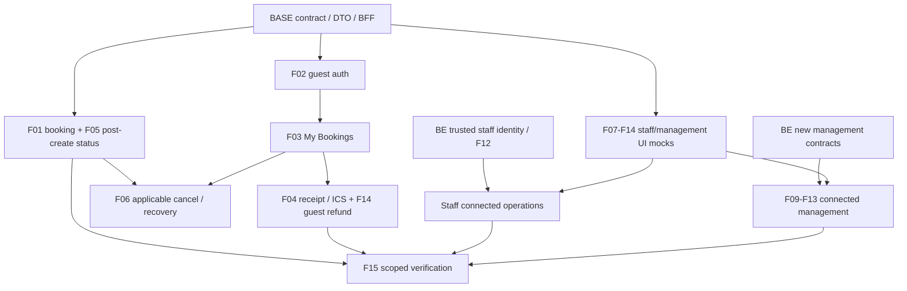

# Urutan eksekusi, dependency dan handoff paralel

Rencana ini melanjutkan demo FE yang ada. User tetap mengembangkan backend; agen tidak mengubah BE untuk menutup gap sebagai bagian task FE. Temuan baru ditulis di docs/gap sesuai arahan user; backend source yang berubah dipakai melalui delta contract review.

## Urutan milestone dan checkpoint perubahan

| Urutan | Slice/commit target | Dependency | Exit |
|---|---|---|---|
| M0a | DTO/status/error/IDR0 dan fixtures aktual | BASE-01 | BASE-02 unit contract tests; mock/API boundary jelas |
| M0b | Runtime config + BFF + session/origin/redaction | M0a | BASE-03/04 SSR/session/health route probe |
| M1a | Catalog/search/single-type/rate selection/quote | M0 | API search/quote totals/policy; UI errors/empty/expiry |
| M1b | Guest/consent/frozen create/post-create status | M1a | isolated create→pending private refresh; stable retry key/body |
| M2a | OTP/login/me/logout | M0, tanpa harus menunggu staff work | Session flow/401/no token in client payload |
| M2b | Booking Saya/private detail/deep link | M2a | Ownership/list empty/filter/error |
| M3a | Receipt/print/ICS + refund read | M2b | Artifacts dan finance guest DTO truthful |
| M3b | Applicable cancellation + bounded payment recovery | M1b/M2b + credential contract | State correct; no unsupported session-token substitution |
| M4a | Staff workspace/login/operations/catalog/finance mocks | M0 DTO; parallel saat identity belum selesai | UI_DONE scoped, routes backend tidak exposed lewat spoof headers |
| M4b | Trusted identity → scoped read → controlled mutations | BE-R01 fixed + provider/data test env | Connected roles/scopes dan mutation acceptance |
| M5 | Rates/channel/notif/configuration by capability | BE contracts as shipped | Small adapter slices + per-feature evidence |
| M6 | Device/connected/provider/pilot verification | Selected capabilities | Scoped acceptance, rollback evidence, tracker final |

Satu slice harus dapat direview dan dites mandiri; hindari satu perubahan besar semua15fitur. Tidak wajib membuat PR/commit setiap slice tanpa instruksi Git terpisah, tetapi batas perubahan tetap digunakan agar review jelas. Existing demo fixture boleh dipertahankan untuk tests/dev dengan explicit mode; production API errors tidak boleh fallback ke mock confirmed/stock/prices.

## Dependency graph

F15 dapat memverifikasi guest subset tanpa menunggu management roadmap selesai; panah menggambarkan scope jika capability tersebut termasuk pilot, bukan gate global semua fitur. UI mocks dan public/read/guest subset tetap maju ketika identity/finance mutation menunggu backend.

## Handoff BE → FE

Per capability user/BE menyediakan environment base URL yang reachable, snapshot/build identity, migration version, auth/session transport, DTO success/error, policy/expiry/status, mutation side effects, allowed_actions, provider mode, and focused acceptance proof. Untuk feature baru, cukup route handler/model/schema dan sample response actual; OpenAPI proposal boleh sebagai tujuan tetapi bukan pengganti runtime contract.

FE memverifikasi contract di source, smoke environment, DTO mapper, then updates matrix/tracker. Jika data handoff belum ada, gunakan interface/mock boundary yang explicit dan lanjut UI/fitur lain; hanya integration subtask menunggu. Jangan menebak endpoint atau memperluas credentials untuk melewati permission.

## Delta protocol saat backend berubah

1. Baca handler/model/schema/middleware impacted; bedakan additive optional field dari perubahan required/status/auth/semantics.
2. Bandingkan source snapshot dengan build/port uji. Jalankan read-only probe terlebih dahulu; liveness200 tidak cukup.
3. Update transport fixture/mapper, capabilities dan row API terkait; annotate endpoint baru SOURCE_PRESENT terlebih dahulu.
4. Jalankan focused contract/security/connected tests; reopen task jika DTO atau ownership berubah.
5. Catat BE gap CLOSED hanya dari source fix + acceptance yang sesuai; laporan gap lama tetap historis. Untuk temuan baru, dokumentasikan di sibling docs/gap tanpa mengubah BE code.
6. Aktifkan capability per lingkungan setelah checks; fitur lain tetap memakai statusnya sendiri.

## Blocker handling

| Keadaan | Tindakan FE |
|---|---|
| Endpoint ada, environment belum reachable | UI/mock + transport contract; tandai connected WAITING_ENV; lanjut independent tasks |
| Backend error/gap correctness | Catat docs/gap, safe error state; mutation live disabled jika invariant diperlukan |
| Staff identity belum tepercaya | Staff UI/mock tests; jangan forward spoof role atau buat token staf sendiri |
| Payload semantics berubah | Reopen mapper/feature, periksa history/retry body; jangan silently coerce |
| Missing endpoint | Interface/mock states sesuai spec; task API WAITING_BE, bukan success fallback |
| User menambah endpoint saat FE jalan | Delta review scoped; lanjut tanpa meminta ulang izin integrasi yang sudah diberikan |

## TODO release/handoff

- [ ] **REL-01:** delta source/gap/contract review per capability, list supported/non-supported tepat, activation prerequisites terbukti.
- [ ] **REL-02:** scoped pilot dan rollback, ownership/contact support jelas, evidence device/provider/environment lengkap.

Tidak ada estimasi kalender yang dikarang: durasi M4/M5 bergantung delivery BE. Urutan M0→M1/M2→M3 memberi guest webapp yang bisa dicoba lebih awal; M4/M5 menyusul per kontrak tanpa menghentikan iterasi guest.
